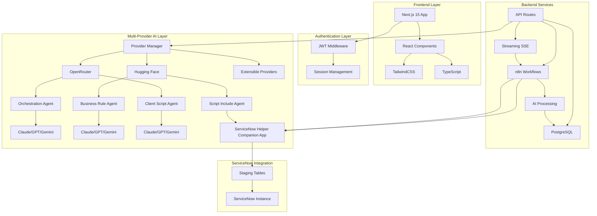
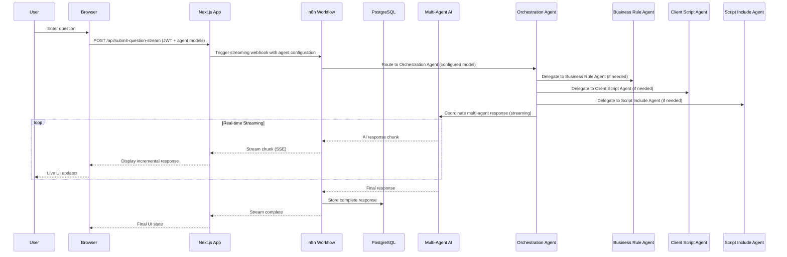

# ServiceNow Helper

<div align="center">


**AI-Powered ServiceNow Assistance Tool**

*Built with Next.js 15.5.2 • Multi-Provider AI Architecture • Security-First Design*

[](https://nextjs.org/)
[](https://www.typescriptlang.org/)
[](https://www.docker.com/)
[](https://www.postgresql.org/)

---

*An intelligent ServiceNow assistance tool featuring **multi-agent AI architecture** with **multiple AI provider support** that provides real-time streaming AI responses through an intuitive web interface and n8n workflow automation. Configure specialized agents with individual AI models from multiple providers (OpenRouter, Hugging Face) for optimized performance and cost flexibility.*

</div>

## Features

### **AI-Powered Intelligence**
Leverage cutting-edge artificial intelligence with **multi-agent AI architecture** and **multiple AI provider support**. Access diverse AI models through OpenRouter, Hugging Face, and extensible provider system. Configure specialized AI agents for different tasks (Orchestration, Business Rules, Client Scripts), get smart ServiceNow question categorization, real-time streaming response generation, and context-aware assistance with cost optimization through provider selection.

### **Robust Security**
Built with security-first principles featuring server-side JWT authentication, Next.js middleware security layers, and comprehensive security headers to protect your data and sessions.

### **Conversation Management**
Complete conversation lifecycle management with full history tracking, advanced search and filtering capabilities, session continuity across interactions, and answer export functionality (Markdown/PDF) for documentation and sharing purposes.

### **Knowledge Store Management**
Comprehensive Knowledge Store management with dedicated interface for viewing, searching, and organizing saved Q&A pairs. Features bulk operations, quality metrics tracking, and metadata management for curated knowledge content.

### **Modern Experience**
Enjoy a responsive design built with TailwindCSS, progressive web app support for mobile devices, dark/light theme toggle for user preference, real-time streaming responses with automatic scrolling, and full accessibility optimization for inclusive usage.

### **Core Capabilities**

| Feature | Description | Technology |
|---------|-------------|------------|
| **Multi-Provider AI Architecture** | Multiple AI providers with specialized agent configuration | OpenRouter + Hugging Face + Extensible |
| **Question Types** | Documentation, Scripts, Troubleshooting | Intelligent Categorization |
| **Real-time Streaming** | Live AI response streaming with performance optimizations | n8n Workflow Engine + SSE |
| **Session Management** | Unique keys & continuation | PostgreSQL Backend |
| **Search Enhancement** | ServiceNow KB integration | API Connections |
| **Provider & Model Management** | Individual model selection per AI agent across multiple providers | Multi-Provider Support + Advanced Filtering |
| **Knowledge Store Management** | Comprehensive Q&A management interface | React Components + PostgreSQL |
| **Script Deployment** | Send generated scripts directly to ServiceNow | N8N Client + ServiceNow API |
| **Answer Export** | Export answers as Markdown or PDF files | jsPDF + File System Access API |
| **Performance Monitoring** | Core Web Vitals & streaming analytics | Performance Monitor + Bundle Analysis |
| **Progressive Web App** | Offline support & native app experience | Service Worker + PWA Manifest |
| **Advanced Testing** | Comprehensive test suite with 347 passing tests | Jest + Playwright + Quality Gates |
| **Bundle Analysis** | Webpack bundle analyzer integration | Performance Insights |
| **Code Quality** | Enhanced ESLint rules & pre-commit hooks | Automated Quality Assurance |
| **Streaming Optimizations** | Virtual scrolling, React.memo, smart batching | Phase 1 Performance Enhancements |
| **Image Optimization** | WebP/AVIF, lazy loading, responsive images | Phase 2 Performance Enhancements |
| **Next.js 15 Features** | Turbopack, enhanced package optimization | Latest Stable Implementation |

## Architecture

### System Overview



### ServiceNow Helper Companion App

The ServiceNow Helper includes a companion application (`848250f153632210030191e0a0490ed5/`) that facilitates seamless integration between the external ServiceNow Helper tool and your ServiceNow instance. This companion app serves as a bridge, implementing a staging table approach for secure and reliable data synchronization.

**Key Features:**
- **Staging Table Architecture**: When data needs to be synchronized to ServiceNow, the integration creates records in staging tables within the companion app
- **Asynchronous Processing**: The companion app processes staged records and synchronizes data with the ServiceNow instance
- **Security & Compliance**: Maintains ServiceNow security policies and audit trails
- **Role-Based Access**: Includes predefined roles for administration and user access:
  - `servicenow helper admin` - Administrates the ServiceNow Helper application and configurations
  - `servicenow helper user` - Able to view data in the ServiceNow Helper application

**Installation:**
The companion app can be installed directly into your ServiceNow instance using the provided XML files in the `848250f153632210030191e0a0490ed5/` directory. The folder name corresponds to the sys_id assigned by ServiceNow upon app creation.

### Request Flow Sequence



## Quick Start

### Prerequisites

```bash
# Required software
✅ Node.js 22+
✅ Docker & Docker Compose
✅ Git
```

### One-Click Setup with Docker

> **Pro Tip:** Use Docker for the fastest setup experience!

**Step 1:** Clone the repository
```bash
git clone https://github.com/your-username/servicenow-helper.git
cd servicenow-helper
```

**Step 2:** Configure environment
```bash
cp .env.example .env
# Edit .env with your API keys
```

**Required Environment Variables:**
```env
OPENAI_API_KEY=your_openai_api_key
OPENROUTER_API_KEY=your_openrouter_api_key
HUGGINGFACE_API_KEY=your_huggingface_api_key
WEBHOOK_API_KEY=secure_random_string
JWT_SECRET=secure_jwt_secret
N8N_ENCRYPTION_KEY=secure_n8n_key
```

**Step 3:** Launch everything
```bash
# First time setup (includes configuration)
docker compose --profile setup up -d

# Subsequent runs
docker compose up -d
```

### Access Points

| Service | URL | Credentials |
|---------|-----|-------------|
| **ServiceNow Helper** | `http://localhost:3000` | `admin` / `password123` |
| **n8n Workflow Manager** | `http://localhost:5678` | `admin@servicenow-helper.local` / `Admin123` |

> **New:** Real-time streaming responses are now enabled by default, providing ChatGPT-like live response generation!

## Tech Stack

<div align="center">

### Frontend


### Backend


### Performance & Quality


### AI & Security


</div>

## Usage Guide

### **Getting Started**
1. **Login** with your credentials to access the secure dashboard
2. **Configure** your preferences in the settings panel
3. **Customize** default search modes and request types
4. **Manage** your knowledge store entries via the dedicated management interface

### **Settings Configuration**

Access the settings via the hamburger menu to personalize your experience:

| Setting | Description | Options |
|---------|-------------|---------|
| **Welcome Section** | Toggle info box visibility | Show/Hide |
| **Default Search Mode** | Set preferred search behavior | On/Off |
| **Default Request Type** | Choose default category | Documentation, Recommendation, Script, Troubleshoot |
| **Multi-Provider Configuration** | Configure AI providers and models for specialized agents | Provider selection + Model assignment per agent |

#### **Multi-Provider AI Architecture**

The ServiceNow Helper supports multiple AI providers for cost optimization and model diversity:

| Provider | Purpose | Supported Models | Cost |
|----------|---------|------------------|------|
| **OpenRouter** | Primary provider with extensive model catalog | Claude, GPT, Gemini, Llama, and 200+ models | Varies by model |
| **Hugging Face** | Open-source and cost-effective models | Open-source models, custom fine-tuned models | Free and paid tiers |
| **Extensible System** | Add custom providers via database configuration | Any API-compatible provider | Configurable |

**Provider Configuration:**
1. **Database Setup**: Providers are configured in the `providers` table with endpoint URLs
2. **API Key Management**: Environment variables follow pattern `{PROVIDER_NAME}_API_KEY`
3. **Model Assignment**: Each AI agent can use models from different providers
4. **Cost Optimization**: Mix free and paid models based on task complexity

#### **Multi-Agent AI Configuration**

Configure different AI models from multiple providers for specialized agents to optimize performance:

| Agent | Purpose | Configurable Models | Provider Options |
|-------|---------|--------------------|--------------------|
| **Orchestration Agent** | Coordinates overall response and routing | Claude, GPT, Gemini, and more | OpenRouter, Hugging Face |
| **Business Rule Agent** | Specialized for ServiceNow business logic | Claude, GPT, Gemini, and more | OpenRouter, Hugging Face |
| **Client Script Agent** | Optimized for client-side scripting | Claude, GPT, Gemini, and more | OpenRouter, Hugging Face |
| **Script Include Agent** | Specializes in reusable server-side JavaScript libraries | Claude, GPT, Gemini, and more | OpenRouter, Hugging Face |

**How to configure agent models:**
1. Navigate to **Settings** via the hamburger menu
2. Expand individual agent cards to view configuration options
3. Use the **Filter** button (funnel icon) to filter and sort available models:
   - **Filter by Type**: Include Free, Paid, and/or Multimodal models (OR logic - selecting multiple filters expands results)
   - **Sort Options**: Alphabetical (A-Z) or Date Added (Oldest First)
   - **Active Filter Indicator**: Badge shows number of active filters
4. Select the optimal AI model for each agent's specialized tasks
5. Models are automatically saved and persisted across sessions

**Advanced Filtering Features:**
- **Inclusive Filtering**: Filter models by cost (free/paid) and capabilities (multimodal) using OR logic
  - **Free Models**: Shows all free models (including multimodal free models)
  - **Paid Models**: Shows all paid models (including multimodal paid models)
  - **Multimodal Models**: Shows all multimodal models (both free and paid)
  - **Multiple Selections**: Selecting multiple filters expands results to include models matching any criteria
- **Intelligent Sorting**: Sort alphabetically or by date added for easy discovery
- **Visual Indicators**: Clear badges show model types and active filters
- **Mobile Optimized**: Larger icons and touch-friendly interface on mobile devices
- **Accessibility**: Full keyboard navigation and screen reader support

### **Asking Questions**

1. **Select Question Type:**
   - **Documentation** - Get comprehensive guides
   - **Recommendation** - Receive best practice advice
   - **Script** - Generate code solutions
   - **Troubleshoot** - Debug and resolve issues

2. **Submit Query** using the intuitive search interface
3. **Watch Live Responses** stream in real-time as the AI generates answers
4. **Enjoy Enhanced UX** with automatic scrolling to responses when streaming starts
5. **Export Answers** as Markdown or PDF files using the Export button in the response header
6. **Deploy Scripts** directly to ServiceNow using the "Send to ServiceNow" button on script code blocks
7. **Access History** through the conversation panel with advanced filtering
8. **Save to Knowledge Store** by clicking the "Add to Knowledge Store" button on helpful responses
9. **Manage Knowledge Store** through the dedicated management interface accessible via the hamburger menu

### **File Attachments (Multimodal Support)**

Enhance your questions with file attachments when using multimodal AI models:

| Feature | Description | Requirements |
|---------|-------------|--------------|
| **File Upload** | Attach images, documents, and other files | Multimodal model selected |
| **Supported Types** | Images (PNG, JPG, GIF), PDFs, text files | Model with image/text capabilities |
| **Audio Support** | Audio file analysis and transcription | Model with audio capabilities |

**How to enable attachments:**
1. Navigate to **Settings** → **AI Models**
2. Define or select a model with multimodal capabilities:
   - ✅ **Text** - Basic text processing
   - ✅ **Image** - Visual content analysis  
   - ✅ **Audio** - Audio file processing
3. The attachment button will appear automatically in the search interface

> **Note:** File attachment functionality is only visible when a multimodal AI model is selected. Models become multimodal when you configure them with image, text, or audio capabilities in the settings menu.

### **Script Deployment to ServiceNow**

Deploy AI-generated scripts directly to your ServiceNow instance with seamless integration:

| Feature | Description | Script Types |
|---------|-------------|--------------|
| **One-Click Deployment** | Send scripts directly from code blocks | Business Rules, Script Includes, Client Scripts |
| **Type Selection Modal** | Choose the correct ServiceNow script type | Automated table targeting |
| **Real-time Feedback** | Instant success/failure notifications | User-friendly error messages |
| **Secure Integration** | Authentication-protected API endpoints | N8N workflow processing |

**How to deploy scripts:**
1. **Generate Scripts** by asking AI for ServiceNow code solutions
2. **Identify Code Blocks** with syntax highlighting in responses
3. **Click Send Button** located next to Copy and Fullscreen buttons on code blocks
4. **Select Script Type** from the modal (Business Rule, Script Include, Client Script)
5. **Confirm Deployment** and receive success confirmation with sys_id
6. **View in ServiceNow** - scripts are created directly in your ServiceNow instance

**Supported Script Types:**
- **Business Rules** → `sys_script` table
- **Script Includes** → `sys_script_include` table  
- **Client Scripts** → `sys_script_client` table

**Integration Benefits:**
- **Seamless Workflow**: No copy-paste needed between ServiceNow Helper and ServiceNow
- **Error Prevention**: Automated table targeting prevents deployment mistakes
- **Audit Trail**: All deployments tracked through ServiceNow's standard audit system
- **Security**: Authentication required and processed through secure N8N workflows

### **Answer Export Functionality**

Save AI-generated answers for documentation, sharing, and offline reference:

| Feature | Description | Formats |
|---------|-------------|---------|
| **Multiple Formats** | Export answers as Markdown or styled PDF | .md, .pdf |
| **Question Inclusion** | Optionally include the original question | Toggle on/off (default: on) |
| **File System Access** | Native save dialog on supported browsers | Chrome, Edge, Opera |
| **Custom Filenames** | Edit filename before saving | Auto-generated with timestamp |
| **Styled PDFs** | PDF exports match UI styling | Headings, code blocks, lists, tables |

**How to export answers:**
1. **Receive Answer** from AI in the response section
2. **Click Export Button** located in the response header (next to response type indicator)
3. **Choose Format** - Select Markdown (.md) or PDF (.pdf) from the modal
4. **Edit Filename** - Customize the filename (default: `ServiceNow-Helper-YYYY-MM-DD-HH-MM-SS`)
5. **Include Question** - Toggle whether to include the original question (enabled by default)
6. **Save File** - Click Export to save
   - **Chrome/Edge/Opera**: Native save dialog to choose destination
   - **Safari/Firefox**: Downloads to default Downloads folder

**Export Formats:**
- **Markdown (.md)** - Plain text format, perfect for documentation systems and version control
- **PDF (.pdf)** - Professionally styled document matching the UI appearance with syntax highlighting

**Browser Support:**
- **File System Access API**: Chrome 86+, Edge 86+, Opera 72+ (native save dialog)
- **Download Fallback**: All modern browsers (automatic download to Downloads folder)
- **PWA Compatible**: Works in both web and Progressive Web App modes

**Export Benefits:**
- **Documentation**: Create searchable documentation from AI responses
- **Knowledge Sharing**: Share formatted answers with team members
- **Offline Reference**: Access important answers without internet connection
- **Version Control**: Track answer evolution with Markdown in Git repositories
- **Professional Output**: PDF exports maintain visual styling for presentations

### **Knowledge Store Management**

Efficiently manage your curated Q&A Knowledge Store with comprehensive management features:

| Feature | Description | Access |
|---------|-------------|--------|
| **Browse All Entries** | View complete list of saved Q&A pairs | Hamburger Menu → Knowledge Store |
| **Search & Filter** | Find entries by keywords in questions/answers | Search bar in management interface |
| **Bulk Operations** | Select and delete multiple entries simultaneously | Checkbox selection + bulk actions |
| **Quality Metrics** | View usage counts and quality scores | Displayed on each entry |
| **Metadata Display** | See creation dates, categories, and tags | Entry details view |
| **Individual Deletion** | Remove specific entries with confirmation | Delete button on each entry |

**How to manage your knowledge store:**
1. **Access Management Interface** via Hamburger Menu → Knowledge Store
2. **Browse Entries** to see all saved Q&A pairs with metadata
3. **Search Content** using the search bar to find specific entries
4. **View Details** by clicking entries to see full answers and metadata
5. **Delete Entries** individually or select multiple for bulk deletion
6. **Navigate Back** using the close button to return to main interface

**Knowledge Store Benefits:**
- **Automated Integration**: AI automatically uses knowledge store content for enhanced responses
- **Quality Tracking**: Monitor which entries are most valuable with usage metrics
- **Organized Content**: Categories and tags help organize and find relevant information
- **Bulk Management**: Efficiently manage large collections of saved Q&A pairs

## Database Configuration

### **Multi-Provider Setup**

The application includes comprehensive database setup for multiple AI providers:

```bash
# Run provider table creation and seeding
docker exec -i servicenow-helper-postgres-1 psql -U n8n -d n8n < scripts/create-providers-table.sql
docker exec -i servicenow-helper-postgres-1 psql -U n8n -d n8n < scripts/seed-providers.sql

# Automatic setup (included in first-time setup)
docker compose --profile setup up -d
```

### **Provider Database Schema**

The `providers` table manages AI provider configurations:

| Column | Type | Description |
|--------|------|-------------|
| `id` | SERIAL | Primary key |
| `name` | VARCHAR(100) | Provider identifier (openrouter, huggingface) |
| `display_name` | VARCHAR(200) | Human-readable name |
| `endpoint` | TEXT | N8N webhook endpoint for provider |
| `is_active` | BOOLEAN | Provider availability status |
| `priority` | INTEGER | Display/selection priority |
| `rate_limit_per_minute` | INTEGER | Rate limiting (optional) |
| `created_at` | TIMESTAMP | Record creation time |
| `updated_at` | TIMESTAMP | Last modification time |

**Default Providers:**
- **OpenRouter** (Priority 100): Comprehensive model catalog with 200+ models
- **Hugging Face** (Priority 90): Open-source and cost-effective models

### **Agent Models Migration**

The application includes a comprehensive database migration system for agent model configuration:

```bash
# Manual migration (if needed)
docker exec -i servicenow-helper-postgres-1 psql -U n8n -d n8n < scripts/migrate-to-agent-models.sql

# Automatic migration (included in setup)
docker compose --profile setup up -d
```

### **Database Schema**

The `agent_models` table stores individual model configurations per user:

| Column | Type | Description |
|--------|------|-------------|
| `id` | SERIAL | Primary key |
| `user_id` | VARCHAR(255) | User identifier |
| `agent_name` | VARCHAR(100) | Agent identifier (orchestration, business_rule, client_script, script_include) |
| `model_name` | VARCHAR(500) | Selected AI model for the agent |
| `created_at` | TIMESTAMP | Record creation time |
| `updated_at` | TIMESTAMP | Last modification time |

**Key Features:**
- **Unique Constraints**: One model per agent per user
- **Backward Compatibility**: Preserves existing single-model configurations
- **Default Values**: Three default agents automatically created for new users
- **Migration Safety**: Comprehensive error handling and rollback capabilities

## Testing Suite

<div align="center">


</div>

### **Unit Testing with Jest**
```bash
npm test              # Watch mode (development)
npm run test:ci       # Single run (CI/CD)
```

### **Integration Testing with Playwright**
```bash
npm run test:e2e            # Headless execution
npm run test:e2e:ui         # Interactive UI mode
npm run test:e2e:headed     # Visible browser mode
npm run test:e2e:debug      # Debug with dev tools
```

### **Test Coverage**
- Authentication flows and session management
- UI component visibility and interactions
- Cross-browser compatibility (Chromium, Firefox)
- Feature access and conversation management
- Responsive design validation

## Project Structure

```
servicenow-helper/
├── README.md, CLAUDE.md, GEMINI.md      # Documentation
├── package.json, package-lock.json      # Dependencies
├── Configuration files                   # ESLint, Jest, Next.js
├── Dockerfile, docker-compose.yml       # Containerization
├── 848250f153632210030191e0a0490ed5/    # ServiceNow Helper Companion App
│   ├── README.md                        # Companion app documentation
│   ├── checksum.txt                     # File integrity verification
│   ├── sys_app_848250f153632210030191e0a0490ed5.xml  # Main app definition
│   └── update/                          # ServiceNow update sets
│       ├── sys_embedded_help_role_*.xml # Help role assignments
│       └── sys_user_role_*.xml         # User roles (admin/user)
├── docs/                                # Detailed documentation
├── n8n/                                 # Workflow templates
├── public/                              # Static assets & PWA
├── scripts/                             # Utility scripts
│   ├── create-providers-table.sql      # Provider table schema creation
│   ├── seed-providers.sql              # Provider data seeding (OpenRouter, Hugging Face)
│   └── migrate-to-agent-models.sql     # Agent models database migration
├── src/                                 # Application source
│   ├── app/                             # Next.js App Router
│   │   ├── api/agent-models/           # Agent model configuration API
│   │   ├── api/ai-models/              # AI model management API
│   │   ├── api/capabilities/           # AI model capabilities API
│   │   ├── api/knowledge-store/        # Knowledge store management API
│   │   ├── api/providers/              # Provider management API
│   │   ├── api/send-script/            # Script deployment API
│   │   ├── api/settings/               # Settings API
│   │   ├── api/submit-question-stream/ # Streaming API
│   │   ├── knowledge-store/            # Knowledge store management page
│   │   └── settings/                   # Settings page
│   ├── components/                      # React components
│   │   ├── CodeBlock.tsx                  # Enhanced code blocks with send functionality
│   │   ├── ExportModal.tsx                # Answer export modal (Markdown/PDF)
│   │   ├── KnowledgeStorePanel.tsx        # Knowledge store management interface
│   │   ├── KnowledgeStoreItem.tsx         # Individual knowledge store entry display
│   │   ├── ResultsSection.tsx             # Results display with export functionality
│   │   ├── SendScriptButton.tsx           # Script deployment button component
│   │   ├── SendScriptModal.tsx            # Script type selection modal
│   │   ├── Settings.tsx                   # Settings component
│   │   └── SearchInterface.tsx            # Main interface (streaming)
│   ├── contexts/                        # React contexts
│   │   ├── AgentModelContext.tsx          # Agent model state management
│   │   ├── AIModelContext.tsx             # AI model state management
│   │   ├── ProviderContext.tsx            # Provider state management
│   │   └── SettingsContext.tsx            # Settings state
│   ├── lib/                             # Utilities
│   │   ├── ai-models.ts                   # AI model utilities and management
│   │   ├── export-utils.ts                # Export utilities (Markdown/PDF generation)
│   │   ├── n8n-client.ts                  # N8N client with knowledge store methods
│   │   ├── pdf-styles.ts                  # PDF styling configuration
│   │   ├── providers.ts                   # Provider management utilities
│   │   ├── streaming-client.ts            # Streaming client
│   │   └── database.ts                    # Database layer (with AgentModelManager)
│   └── types/                           # TypeScript definitions (with export types)
└── tests/                               # Test files and mocks
```

## Available Commands

<div align="center">

| Command | Description | Usage |
|---------|-------------|-------|
| `npm run dev` | Development server | Local development |
| `npm run build` | Production build with PWA | Deployment prep |
| `npm run build:analyze` | Build with bundle analyzer | Performance insights |
| `npm run start` | Production server | Live deployment |
| `npm run lint` | Enhanced ESLint checks | Code quality |
| `npm run type-check` | TypeScript validation | Type safety |
| `npm test` | Jest unit tests (watch mode) | Component testing |
| `npm run test:watch` | Jest tests in watch mode | Development testing |
| `npm run test:coverage` | Jest with coverage reports | Test coverage |
| `npm run test:ci` | Jest for CI/CD | Automated testing |
| `npm run test:performance` | Performance-specific tests | Performance validation |
| `npm run test:e2e` | Playwright integration tests | Full app testing |
| `npm run test:e2e:ui` | Playwright with UI mode | Interactive testing |
| `npm run test:e2e:headed` | Playwright headed mode | Visual testing |
| `npm run test:e2e:debug` | Playwright debug mode | Test debugging |

</div>

### Docker Commands

```bash
# First time setup
docker compose --profile setup up -d

# Regular operations
docker compose up -d                    # Start services
docker compose down                     # Stop services
docker compose logs -f                  # View logs
docker compose up -d --build           # Rebuild & start
```

## Documentation

<div align="center">

| Guide | Focus | Link |
|----------|----------|---------|
| **Setup** | Installation & Configuration | [Getting Started](./docs/SETUP.md) |
| **PWA** | Progressive Web App Features | [PWA Guide](./docs/PWA.md) |
| **Environment** | Variable Configuration | [Environment](./docs/ENVIRONMENT_VARIABLES.md) |
| **Development** | Contributing & Development | [Dev Guide](./docs/DEVELOPMENT.md) |
| **Testing** | Testing Strategies | [Testing](./docs/TESTING.md) |
| **Contributing** | Contribution Guidelines | [Contributing](./docs/CONTRIBUTING.md) |

</div>

## Contributing

We welcome contributions! Please see our [Contributing Guide](./docs/CONTRIBUTING.md) for details on:

- Bug reports and feature requests
- Code contributions and pull requests  
- Documentation improvements
- Testing and quality assurance

## License

<div align="center">

**MIT License**

*This project is licensed under the MIT License. See the [LICENSE](./LICENSE) file for details.*

---
</div>
