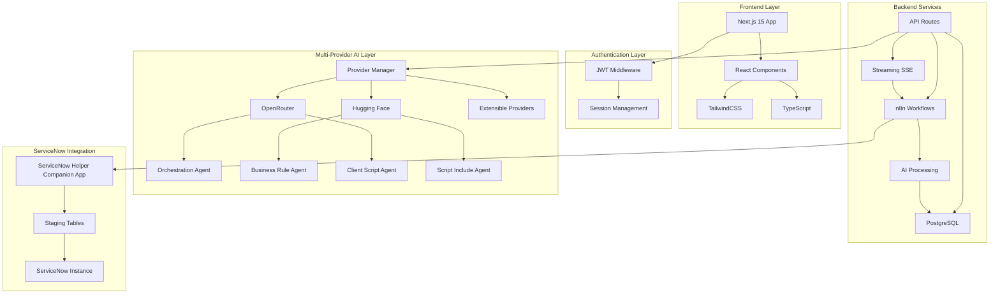

# ServiceNow Helper

<div align="center">


**AI-Powered ServiceNow Assistance Tool**

*Built with Next.js 15.5.2 • Multi-Provider AI Architecture • Security-First Design*

[](https://nextjs.org/)
[](https://www.typescriptlang.org/)
[](https://www.docker.com/)
[](https://www.postgresql.org/)

---

*An intelligent ServiceNow assistance tool featuring **multi-agent AI architecture** with **multiple AI provider support** that provides real-time streaming AI responses through an intuitive web interface and n8n workflow automation. Configure specialized agents with individual AI models from multiple providers (OpenRouter, Hugging Face) for optimized performance and cost flexibility.*

</div>

## Features

- **Multi-Agent AI Architecture** - Specialized AI agents (Orchestration, Business Rules, Client Scripts, Script Includes) with individual model configuration
- **Multi-Provider Support** - OpenRouter, Hugging Face, and extensible provider system for cost optimization
- **Real-time Streaming** - ChatGPT-like live response generation with Server-Sent Events (SSE)
- **Robust Security** - JWT authentication, httpOnly cookies, comprehensive security headers
- **Conversation Management** - Full history tracking, search/filtering, session continuity
- **Knowledge Store** - Curated Q&A management with bulk operations and quality metrics
- **Mermaid Diagrams** - AI-generated flowcharts and diagrams with streaming support
- **Answer Export** - Export as Markdown or PDF with rendered diagrams
- **Script Deployment** - Send generated scripts directly to ServiceNow
- **Modern UI** - TailwindCSS 4.1, dark/light theme, PWA support, full accessibility
- **Comprehensive Testing** - 347 passing tests with Jest and Playwright

##  Quick Start

### Prerequisites

```bash
 Node.js 22+
 Docker & Docker Compose
 Git
```

### One-Click Setup with Docker

**Step 1:** Clone and configure

```bash
git clone https://github.com/your-username/servicenow-helper.git
cd servicenow-helper
cp .env.example .env
# Edit .env with your API keys
```

**Step 2:** Launch everything

```bash
# First time setup (includes configuration)
docker compose --profile setup up -d

# Subsequent runs
docker compose up -d
```

### Access Points

| Service | URL | Credentials |
|---------|-----|-------------|
| **ServiceNow Helper** | `http://localhost:3000` | `admin` / `password123` |
| **n8n Workflow Manager** | `http://localhost:5678` | `admin@servicenow-helper.local` / `Admin123` |

> **New:** Real-time streaming responses enabled by default, providing ChatGPT-like live response generation!

## Architecture

### System Overview



**Core Components:**
- **Next.js 15.5.2 Frontend** - User interface, authentication, streaming responses
- **n8n Workflow Engine** - AI processing, multi-agent orchestration, ServiceNow integration
- **PostgreSQL 15.4 + pgvector** - Data persistence, vector search, user settings
- **ServiceNow Companion App** - Secure integration with ServiceNow instance

 **[View Detailed Architecture Documentation](./docs/ARCHITECTURE.md)**

## Usage

### Getting Started

1. **Login** with your credentials
2. **Configure settings** via hamburger menu (agent models, providers, preferences)
3. **Ask questions** with real-time streaming responses
4. **Export answers** as Markdown or PDF
5. **Deploy scripts** directly to ServiceNow
6. **Manage knowledge store** for curated Q&A pairs

### Key Features

**Multi-Agent Configuration:**
- Navigate to Settings → Configure individual agents
- Select AI models per agent from multiple providers
- Filter by cost (Free/Paid) and capabilities (Multimodal)
- Optimize performance and cost

**Question Types:**
- **Documentation** - Comprehensive guides
- **Recommendation** - Best practice advice
- **Script** - Code generation
- **Troubleshoot** - Debug and resolve issues

**Multimodal Support:**
- Attach images, PDFs, audio files
- AI analyzes screenshots, diagrams, error messages
- Configure multimodal capabilities in settings

**Script Deployment:**
- One-click deployment to ServiceNow
- Business Rules, Script Includes, Client Scripts
- Real-time feedback with sys_id confirmation

**Mermaid Diagrams:**
- AI-generated flowcharts, sequence diagrams, ER diagrams
- Automatic rendering with theme support
- Export as code (Markdown) or images (PDF)

**[View Complete Usage Guide](./docs/USAGE.md)**

## Database Configuration

ServiceNow Helper uses PostgreSQL with comprehensive multi-provider and multi-agent support.

**Key Tables:**
- `providers` - AI provider configurations (OpenRouter, Hugging Face)
- `agent_models` - Agent-to-model mappings per user
- `user_settings` - User preferences and configuration
- `ServiceNowSupportTool` - Conversation history
- `ai_models` - Model definitions with capabilities

**Automatic Setup:**
```bash
docker compose --profile setup up -d
```

This automatically:
- Creates all database tables
- Seeds default providers (OpenRouter, Hugging Face)
- Runs agent model migration
- Configures multimodal capabilities

**[View Database Documentation](./docs/DATABASE.md)**

## UI Design System

The application follows a **modern, cohesive design system** with glassmorphism, smooth animations, and full accessibility.

**Key Design Principles:**
- **Chip-Style Buttons** - Rounded-full with gradients, shadows, scale animations
- **Pill-Style Badges** - Consistent rounded badges for status indicators
- **Modern Cards** - Glassmorphism with backdrop-blur and colored shadows
- **Interactive Elements** - Smooth scale animations on all clickable elements
- **Dark Mode Support** - Complete theme support with semantic colors
- **Accessibility** - WCAG AA compliance, keyboard navigation, ARIA labels

**[View UI Design System Documentation](./docs/UI_DESIGN.md)**

## Testing

```bash
# Unit Tests
npm test                    # Watch mode
npm run test:ci             # CI/CD mode
npm run test:coverage       # With coverage

# Integration Tests
npm run test:e2e            # Headless
npm run test:e2e:ui         # Interactive UI
npm run test:e2e:debug      # Debug mode
```

**Test Coverage:**
- Authentication flows
- UI component interactions
- Cross-browser compatibility
- Performance validation

**[View Testing Documentation](./docs/TESTING.md)**

## Tech Stack

<div align="center">

### Frontend


### Backend


### Performance & Quality


### AI & Security


</div>

## Available Commands

<div align="center">

| Command | Description |
|---------|-------------|
| `npm run dev` | Development server with hot reload |
| `npm run build` | Production build with PWA optimization |
| `npm run build:analyze` | Build with webpack bundle analyzer |
| `npm run start` | Production server |
| `npm run lint` | ESLint checks with auto-fix |
| `npm run type-check` | TypeScript validation |
| `npm test` | Jest unit tests (watch mode) |
| `npm run test:coverage` | Jest with coverage reports |
| `npm run test:ci` | Jest for CI/CD |
| `npm run test:e2e` | Playwright integration tests |
| `npm run test:e2e:ui` | Playwright with UI mode |
| `docker compose up -d` | Start all services |
| `docker compose down` | Stop all services |

</div>

## Documentation

<div align="center">

| Documentation | Description |
|--------------|-------------|
| **[Architecture Guide](./docs/ARCHITECTURE.md)** | System architecture, components, and data flow |
| **[Usage Guide](./docs/USAGE.md)** | Complete feature documentation and workflows |
| **[UI Design System](./docs/UI_DESIGN.md)** | Design principles and component patterns |
| **[Database Configuration](./docs/DATABASE.md)** | Database schema, setup, and management |
| **[Setup Guide](./docs/SETUP.md)** | Installation and configuration |
| **[Environment Variables](./docs/ENVIRONMENT_VARIABLES.md)** | Configuration reference |
| **[Development Guide](./docs/DEVELOPMENT.md)** | Development workflows and best practices |
| **[Testing Guide](./docs/TESTING.md)** | Testing strategies and execution |
| **[PWA Guide](./docs/PWA.md)** | Progressive Web App features |
| **[Mermaid Diagrams](./docs/MERMAID_DIAGRAMS.md)** | Diagram generation and export |
| **[Contributing](./docs/CONTRIBUTING.md)** | Contribution guidelines |

</div>

## Contributing

We welcome contributions! Please see our [Contributing Guide](./docs/CONTRIBUTING.md) for details on:

- Bug reports and feature requests
- Code contributions and pull requests
- Documentation improvements
- Testing and quality assurance

## License

<div align="center">

**MIT License**

*This project is licensed under the MIT License. See the [LICENSE](./LICENSE) file for details.*

</div>
