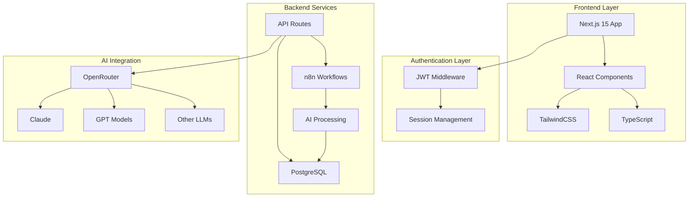
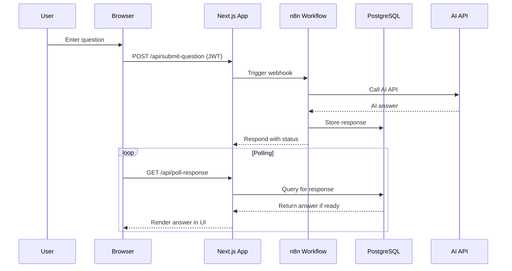

# ServiceNow Helper

<div align="center">


**AI-Powered ServiceNow Assistance Tool**

*Built with Next.js 15 • AI-Powered by OpenRouter • Security-First Design*

[](https://nextjs.org/)
[](https://www.typescriptlang.org/)
[](https://www.docker.com/)
[](https://www.postgresql.org/)

---

*An intelligent ServiceNow assistance tool that provides real-time AI responses through an intuitive web interface and n8n workflow automation.*

</div>

## Features

### **AI-Powered Intelligence**
Leverage cutting-edge artificial intelligence with access to multiple text-based AI models through OpenRouter integration. Get smart ServiceNow question categorization, real-time response generation, and context-aware assistance that understands your specific needs.

### **Robust Security**
Built with security-first principles featuring server-side JWT authentication, Next.js middleware security layers, and comprehensive security headers to protect your data and sessions.

### **Conversation Management** 
Complete conversation lifecycle management with full history tracking, advanced search and filtering capabilities, session continuity across interactions, and export functionality for documentation purposes.

### **Modern Experience**
Enjoy a responsive design built with TailwindCSS, progressive web app support for mobile devices, dark/light theme toggle for user preference, and full accessibility optimization for inclusive usage.

### **Core Capabilities**

| Feature | Description | Technology |
|---------|-------------|------------|
| **Multiple AI Models** | Access to Claude, GPT, and more | OpenRouter Integration |
| **Question Types** | Documentation, Scripts, Troubleshooting | Intelligent Categorization |
| **Real-time Responses** | Async webhook polling | n8n Workflow Engine |
| **Session Management** | Unique keys & continuation | PostgreSQL Backend |
| **Search Enhancement** | ServiceNow KB integration | API Connections |
| **User Customization** | Persistent preferences | Settings Management |

## Architecture

### System Overview



### Request Flow Sequence



## Quick Start

### Prerequisites

```bash
# Required software
✅ Node.js 18+
✅ Docker & Docker Compose
✅ Git
```

### One-Click Setup with Docker

> **Pro Tip:** Use Docker for the fastest setup experience!

**Step 1:** Clone the repository
```bash
git clone https://github.com/your-username/servicenow-helper.git
cd servicenow-helper
```

**Step 2:** Configure environment
```bash
cp .env.example .env
# Edit .env with your API keys
```

**Required Environment Variables:**
```env
OPENAI_API_KEY=your_openai_api_key
OPENROUTER_API_KEY=your_openrouter_api_key
WEBHOOK_API_KEY=secure_random_string
JWT_SECRET=secure_jwt_secret
N8N_ENCRYPTION_KEY=secure_n8n_key
```

**Step 3:** Launch everything
```bash
# First time setup (includes configuration)
docker compose --profile setup up -d

# Subsequent runs
docker compose up -d
```

### Access Points

| Service | URL | Credentials |
|---------|-----|-------------|
| **ServiceNow Helper** | `http://localhost:3000` | `admin` / `password123` |
| **n8n Workflow Manager** | `http://localhost:5678` | `admin@servicenow-helper.local` / `Admin123` |

## Tech Stack

<div align="center">

### Frontend


### Backend


### AI & Security


</div>

## Usage Guide

### **Getting Started**
1. **Login** with your credentials to access the secure dashboard
2. **Configure** your preferences in the settings panel
3. **Customize** default search modes and request types

### **Settings Configuration**

Access the settings via the hamburger menu to personalize your experience:

| Setting | Description | Options |
|---------|-------------|---------|
| **Welcome Section** | Toggle info box visibility | Show/Hide |
| **Default Search Mode** | Set preferred search behavior | On/Off |
| **Default Request Type** | Choose default category | Documentation, Recommendation, Script, Troubleshoot |

### **Asking Questions**

1. **Select Question Type:**
   - **Documentation** - Get comprehensive guides
   - **Recommendation** - Receive best practice advice
   - **Script** - Generate code solutions
   - **Troubleshoot** - Debug and resolve issues

2. **Submit Query** using the intuitive search interface
3. **View Responses** with markdown formatting and syntax highlighting
4. **Access History** through the conversation panel with advanced filtering

## Testing Suite

<div align="center">


</div>

### **Unit Testing with Jest**
```bash
npm test              # Watch mode (development)
npm run test:ci       # Single run (CI/CD)
```

### **Integration Testing with Playwright**
```bash
npm run test:e2e            # Headless execution
npm run test:e2e:ui         # Interactive UI mode
npm run test:e2e:headed     # Visible browser mode
npm run test:e2e:debug      # Debug with dev tools
```

### **Test Coverage**
- Authentication flows and session management
- UI component visibility and interactions
- Cross-browser compatibility (Chromium, Firefox)
- Feature access and conversation management
- Responsive design validation

## Project Structure

```
servicenow-helper/
├── README.md, CLAUDE.md, GEMINI.md      # Documentation
├── package.json, package-lock.json      # Dependencies
├── Configuration files                   # ESLint, Jest, Next.js
├── Dockerfile, docker-compose.yml       # Containerization
├── docs/                                # Detailed documentation
├── n8n/                                 # Workflow templates
├── public/                              # Static assets & PWA
├── scripts/                             # Utility scripts
├── src/                                 # Application source
│   ├── app/                             # Next.js App Router
│   │   ├── api/settings/               # Settings API
│   │   └── settings/                   # Settings page
│   ├── components/                      # React components
│   │   ├── Settings.tsx                   # Settings component
│   │   └── SearchInterface.tsx            # Main interface
│   ├── contexts/                        # React contexts
│   │   └── SettingsContext.tsx            # Settings state
│   ├── lib/                             # Utilities
│   │   └── database.ts                    # Database layer
│   └── types/                           # TypeScript definitions
└── tests/                               # Test files and mocks
```

## Available Commands

<div align="center">

| Command | Description | Usage |
|---------|-------------|-------|
| `npm run dev` | Development server | Local development |
| `npm run build` | Production build | Deployment prep |
| `npm run start` | Production server | Live deployment |
| `npm run lint` | Code quality check | Code review |
| `npm test` | Unit testing | Component testing |
| `npm run test:e2e` | Integration testing | Full app testing |

</div>

### Docker Commands

```bash
# First time setup
docker compose --profile setup up -d

# Regular operations
docker compose up -d                    # Start services
docker compose down                     # Stop services
docker compose logs -f                  # View logs
docker compose up -d --build           # Rebuild & start
```

## Documentation

<div align="center">

| Guide | Focus | Link |
|----------|----------|---------|
| **Setup** | Installation & Configuration | [Getting Started](./docs/SETUP.md) |
| **PWA** | Progressive Web App Features | [PWA Guide](./docs/PWA.md) |
| **Environment** | Variable Configuration | [Environment](./docs/ENVIRONMENT_VARIABLES.md) |
| **Development** | Contributing & Development | [Dev Guide](./docs/DEVELOPMENT.md) |
| **Testing** | Testing Strategies | [Testing](./docs/TESTING.md) |
| **Contributing** | Contribution Guidelines | [Contributing](./docs/CONTRIBUTING.md) |

</div>

## Contributing

We welcome contributions! Please see our [Contributing Guide](./docs/CONTRIBUTING.md) for details on:

- Bug reports and feature requests
- Code contributions and pull requests  
- Documentation improvements
- Testing and quality assurance

## License

<div align="center">

**MIT License**

*This project is licensed under the MIT License. See the [LICENSE](./LICENSE) file for details.*

---
</div>
