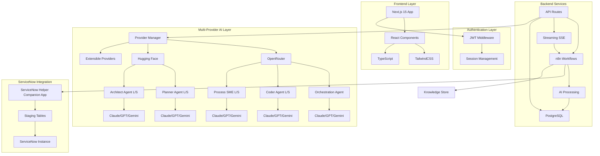
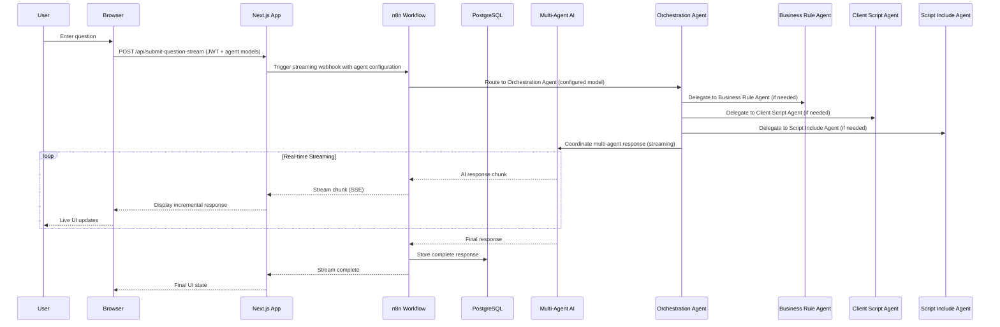
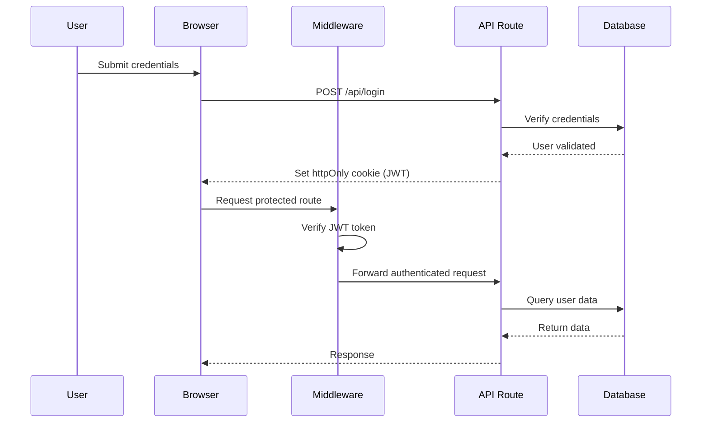
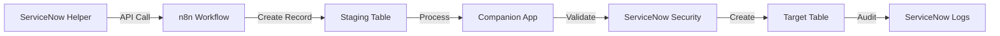

# Architecture Documentation

This document provides comprehensive technical architecture information for the ServiceNow Helper application.

## Table of Contents

- [System Overview](#system-overview)
- [Architecture Layers](#architecture-layers)
- [Request Flow](#request-flow)
- [Multi-Agent AI Architecture](#multi-agent-ai-architecture)
- [Streaming System](#streaming-system)
- [Authentication & Security](#authentication--security)
- [Data Flow](#data-flow)
- [ServiceNow Integration](#servicenow-integration)
- [Component Architecture](#component-architecture)
- [Technology Stack](#technology-stack)

---

## System Overview

ServiceNow Helper follows a **containerized, multi-service architecture** orchestrated by Docker Compose, featuring a modern tech stack with Next.js 15, n8n workflow automation, and PostgreSQL database.

### High-Level Architecture



### Core Services

| Service | Technology | Port | Purpose |
|---------|-----------|------|---------|
| **Frontend** | Next.js 15.5.2 | 3000 | User interface, authentication, streaming responses |
| **Backend** | n8n | 5678 | Workflow automation, AI processing, ServiceNow integration |
| **Database** | PostgreSQL 15.4 + pgvector | 5432 | Data persistence, vector search, user settings |
| **Containerization** | Docker Compose | N/A | Service orchestration, networking, volumes |

---

## Architecture Layers

### 1. Presentation Layer (Frontend)

**Technology:** Next.js 15.5.2 with App Router

**Components:**
- `SearchInterface` - Main application interface
- `ResultsSection` - Real-time response display
- `Settings` - User preferences and agent configuration
- `HistoryPanel` - Conversation history
- `KnowledgeStorePanel` - Knowledge management interface

**Features:**
- Server-side rendering (SSR) for initial page load
- Client-side rendering (CSR) for dynamic interactions
- Real-time streaming with Server-Sent Events (SSE)
- Progressive Web App (PWA) capabilities
- Dark/light theme support

**State Management:**
- React Context API for global state
- `AuthContext` - Authentication state
- `SettingsContext` - User preferences
- `AgentModelContext` - Agent model configurations
- `AIModelContext` - AI model management
- `ProviderContext` - Provider selection
- `ThemeContext` - Theme preferences

### 2. Authentication Layer

**Technology:** JWT (JSON Web Tokens) with httpOnly cookies

**Flow:**
1. User submits credentials via `LoginForm`
2. Next.js API validates credentials
3. JWT token generated and set as httpOnly cookie
4. Middleware verifies token on protected routes
5. Token includes user_id for data isolation

**Security Features:**
- httpOnly cookies prevent XSS attacks
- Secure flag for HTTPS-only transmission
- SameSite attribute for CSRF protection
- Token expiration and refresh mechanism
- Server-side verification on all API routes

**Implementation:**
- `src/lib/auth-middleware.ts` - Token verification
- `src/contexts/AuthContext.tsx` - Client-side state
- `src/middleware.ts` - Next.js middleware for route protection

### 3. API Layer

**Technology:** Next.js 15 App Router API Routes

**Key Endpoints:**

| Endpoint | Method | Purpose | Authentication |
|----------|--------|---------|----------------|
| `/api/login` | POST | User authentication | Public |
| `/api/logout` | POST | Session termination | Protected |
| `/api/submit-question-stream` | POST | Streaming question submission | Protected |
| `/api/cancel-request` | POST | Cancel streaming request | Protected |
| `/api/settings` | GET/PUT | User settings management | Protected |
| `/api/agent-models` | GET/POST/PUT | Agent model configuration | Protected |
| `/api/ai-models` | GET/POST/PUT/DELETE | AI model management | Protected |
| `/api/providers` | GET | Provider information | Protected |
| `/api/capabilities` | GET | Model capabilities | Protected |
| `/api/knowledge-store` | GET/POST/DELETE | Knowledge store management | Protected |
| `/api/send-script` | POST | Script deployment to ServiceNow | Protected |

**API Features:**
- RESTful design principles
- JSON request/response format
- Error handling with appropriate HTTP status codes
- Rate limiting and request validation
- CORS configuration for security

### 4. Workflow Layer

**Technology:** n8n (Workflow Automation)

**Purpose:**
- Orchestrate AI processing workflows
- Manage multi-provider AI communication
- Handle ServiceNow API integration
- Process streaming responses
- Coordinate multi-agent interactions

**Key Workflows:**
- Question processing with agent routing
- Script deployment to ServiceNow
- Knowledge store integration
- Provider failover and retry logic
- Response streaming and chunking

**Benefits:**
- Visual workflow editor for easy modification
- Built-in error handling and retry mechanisms
- Webhook support for API integration
- Scheduled tasks for maintenance
- Extensible with custom nodes

### 5. Data Layer

**Technology:** PostgreSQL 15.4 with pgvector 0.8.0

**Schema Design:**
- User isolation with `user_id` foreign keys
- Normalized tables for data integrity
- Indexes for query performance
- Vector columns for semantic search

**Key Tables:**
- `ServiceNowSupportTool` - Conversation history
- `user_settings` - User preferences
- `agent_models` - Agent model mappings
- `providers` - AI provider configurations
- `ai_models` - Model definitions
- `capabilities` - Model capabilities (text, image, audio)

**See [Database Documentation](./DATABASE.md) for detailed schema information.**

---

## Request Flow

### Standard Request Flow



### Streaming Request Details

**1. Client Initiates Request:**
- User submits question with selected type
- Agent model configurations attached
- File attachments included (if multimodal)
- JWT token verified in middleware

**2. API Establishes SSE Connection:**
- `/api/submit-question-stream` creates EventSource connection
- Headers configured for streaming
- Connection pooling managed
- Timeout and retry logic applied

**3. n8n Processes Request:**
- Webhook receives question and configuration
- Orchestration agent analyzes request
- Specialized agents invoked as needed
- AI provider selected based on agent configuration

**4. AI Response Streaming:**
- Provider streams response chunks
- n8n forwards chunks to Next.js SSE
- Chunks processed and formatted
- Incremental markdown rendering

**5. UI Updates in Real-Time:**
- EventSource receives chunks
- StreamingMarkdownRenderer updates display
- Virtual scrolling for large content
- Automatic scroll to response

**6. Request Completion:**
- Final response stored in database
- Connection closed gracefully
- UI transitions to final state
- Actions enabled (export, save, deploy)

### Cancellation Flow

**User Cancels Request:**
1. User clicks stop button
2. Frontend sends cancellation signal
3. SSE connection closed immediately
4. Backend notified via `/api/cancel-request`
5. n8n workflow cancellation attempted
6. Partial response saved (if applicable)

---

## Multi-Agent AI Architecture

### Agent Specialization

The multi-agent architecture allows different AI models to specialize in different tasks. Each specialized agent type has Large and Small variants for complex vs. well-defined tasks.

**Orchestration Agent:**
- **Role**: Coordinator and router
- **Responsibilities**:
  - Analyze incoming questions
  - Determine which specialized agents to invoke
  - Coordinate responses from multiple agents
  - Synthesize final unified response
- **Model Selection**: Typically uses most capable model (e.g., Claude Sonnet 4)

**Planner Agents (Large/Small):**
- **Role**: Strategic planning and solution design specialist
- **Responsibilities**:
  - Analyze requirements and design solutions
  - Create implementation strategies
  - Design technical approaches
  - Plan process optimization
- **Large Variant**: Complex strategic planning requiring deep analysis
- **Small Variant**: Well-defined planning tasks
- **Model Selection**: Optimized for analysis and strategic thinking

**Coder Agents (Large/Small):**
- **Role**: Code generation and technical implementation specialist
- **Responsibilities**:
  - Generate scripts, code snippets, and technical implementations
  - Create business rules, client scripts, and service-side logic
  - Implement technical solutions
  - Debug and optimize code
- **Large Variant**: Complex coding tasks requiring sophisticated logic
- **Small Variant**: Simple code snippets and well-defined implementations
- **Model Selection**: Optimized for code generation and logic

**Architect Agents (Large/Small):**
- **Role**: System design and architecture specialist
- **Responsibilities**:
  - Design system architecture and data models
  - Create technical frameworks
  - Design scalable solutions
  - Plan system integration
- **Large Variant**: Complex architecture design requiring deep analysis
- **Small Variant**: Well-defined architectural tasks
- **Model Selection**: Optimized for system design and framework thinking

**Process SME Agents (Large/Small):**
- **Role**: Subject matter expert for ServiceNow workflows and processes
- **Responsibilities**:
  - Provide expertise on ServiceNow workflows
  - Optimize business processes
  - Configure platform features
  - Explain process best practices
- **Large Variant**: Complex workflow analysis and optimization
- **Small Variant**: Quick process questions and guidance
- **Model Selection**: Optimized for process expertise and platform knowledge

### Size Variants

**Large Variant:**
- For complex tasks requiring more thought and analysis
- Slower processing and more expensive
- Better for intricate problems requiring deeper reasoning

**Small Variant:**
- For well-defined, straightforward tasks
- Faster processing and more cost-effective
- Ideal for routine requests with clear parameters

### Agent Communication

**Routing Logic:**
```typescript
// Simplified agent routing logic
function routeToAgents(question: string, type: RequestType, complexity: 'large' | 'small') {
  const agents = [orchestration];

  // Determine complexity level for specialized agents
  const sizeVariant = complexity; // 'large' for complex, 'small' for well-defined

  if (type === 'recommendation' || type === 'documentation') {
    // Planning tasks
    agents.push(`planner_${sizeVariant}`);
  }

  if (type === 'script') {
    // Code generation tasks
    agents.push(`coder_${sizeVariant}`);
  }

  if (type === 'troubleshoot' || type === 'ai-skill') {
    // May involve architecture or process expertise
    if (question.includes('architecture') || question.includes('design')) {
      agents.push(`architect_${sizeVariant}`);
    } else {
      agents.push(`process_sme_${sizeVariant}`);
    }
  }

  if (type === 'ai-agent') {
    // Agent building requires planning and coding
    agents.push(`planner_${sizeVariant}`);
    agents.push(`coder_${sizeVariant}`);
  }

  return agents;
}
```

**Coordination:**
- Orchestration agent receives all requests first
- Determines if specialized agents needed
- Invokes specialists in parallel or sequence
- Combines responses into cohesive answer
- Ensures consistent formatting and style

### Multi-Provider Support

**Provider Selection:**
- Each agent can use different provider
- Configuration stored per user, per agent
- Allows cost optimization and model diversity
- Failover to alternative providers if needed

**Provider Integration:**
- Unified API interface for all providers
- Provider-specific endpoint configuration
- API key management per provider
- Rate limiting per provider

---

## Streaming System

### Server-Sent Events (SSE)

**Why SSE:**
- Unidirectional server-to-client communication
- Built-in reconnection logic
- Simple HTTP-based protocol
- Efficient for streaming text data
- Native browser support

**Implementation:**
```typescript
// Client-side EventSource
const eventSource = new EventSource('/api/submit-question-stream', {
  headers: { Authorization: `Bearer ${token}` }
});

eventSource.onmessage = (event) => {
  const chunk = JSON.parse(event.data);
  updateUI(chunk);
};
```

### Streaming Architecture Components

**StreamingClient (`src/lib/streaming-client.ts`):**
- Manages SSE connection lifecycle
- Handles reconnection with exponential backoff
- Implements error classification
- Provides connection health monitoring

**StreamingCancellationManager (`src/lib/streaming-cancellation.ts`):**
- Multi-layer cancellation system
- Abort controller management
- Cleanup coordination
- Race condition prevention

**StreamingMarkdownRenderer (`src/components/StreamingMarkdownRenderer.tsx`):**
- Incremental markdown rendering
- Virtual scrolling for large content
- Streaming cursor animation
- Performance optimization with React.memo

**StreamingBuffer (`src/lib/streaming-buffer.ts`):**
- Smart chunk batching
- Dynamic interval adjustment
- Memory-efficient updates
- Content type analysis

### Performance Optimizations

**Virtual Scrolling:**
- Render only visible content
- Efficient for large responses (>10k characters)
- Smooth scrolling performance

**Smart Batching:**
- Group multiple chunks before rendering
- Reduce React re-renders
- Adjust batch size dynamically

**React.memo:**
- Memoize expensive components
- Custom comparison functions
- Prevent unnecessary re-renders

**Code Splitting:**
- Lazy load heavy components
- Dynamic imports for ReactMarkdown
- Suspense boundaries for graceful loading

---

## Authentication & Security

### JWT Authentication Flow



### Security Headers

**Implemented in `next.config.ts`:**
```typescript
headers: [
  {
    source: '/:path*',
    headers: [
      { key: 'X-Content-Type-Options', value: 'nosniff' },
      { key: 'X-Frame-Options', value: 'DENY' },
      { key: 'X-XSS-Protection', value: '1; mode=block' },
      { key: 'Referrer-Policy', value: 'strict-origin-when-cross-origin' },
      { key: 'Permissions-Policy', value: 'camera=(), microphone=(), geolocation=()' }
    ]
  }
]
```

### Data Protection

**User Data Isolation:**
- All queries filter by `user_id` from JWT
- No cross-user data access possible
- Settings and history isolated per user

**API Key Security:**
- Stored in environment variables only
- Never exposed to frontend
- Rotated regularly in production

**Input Validation:**
- All inputs sanitized and validated
- Type checking with TypeScript
- SQL injection prevention with parameterized queries
- XSS prevention with React escaping

---

## Data Flow

### Question Submission Flow

```
User Input
    ↓
SearchInterface Component
    ↓
JWT Authentication Check
    ↓
/api/submit-question-stream
    ↓
Agent Model Configuration Lookup
    ↓
n8n Webhook (with agent configs)
    ↓
Multi-Agent AI Processing
    ↓
Streaming Response Chunks
    ↓
Server-Sent Events (SSE)
    ↓
StreamingMarkdownRenderer
    ↓
User Sees Live Response
    ↓
Save to Database
```

### Settings Update Flow

```
User Changes Settings
    ↓
Settings Component
    ↓
SettingsContext Update
    ↓
PUT /api/settings or /api/agent-models
    ↓
JWT Verification
    ↓
Database Update (PostgreSQL)
    ↓
Success Response
    ↓
Context State Updated
    ↓
UI Reflects Changes
```

### Script Deployment Flow

```
AI Generates Script
    ↓
CodeBlock Component Renders
    ↓
User Clicks "Send to ServiceNow"
    ↓
SendScriptModal Opens
    ↓
User Selects Script Type
    ↓
POST /api/send-script
    ↓
N8NClient.createTask()
    ↓
n8n Workflow Triggered
    ↓
ServiceNow API Call
    ↓
Staging Table Record Created
    ↓
ServiceNow Companion App Processes
    ↓
Script Created in Target Table
    ↓
Success Response with sys_id
    ↓
UI Shows Success Message
```

---

## ServiceNow Integration

### Companion App Architecture

**ServiceNow Helper Companion App** (`848250f153632210030191e0a0490ed5/`)

**Purpose:**
- Bridge between external tool and ServiceNow
- Secure data synchronization
- Staging table architecture
- Asynchronous processing

**Key Features:**

| Feature | Description | Benefit |
|---------|-------------|---------|
| **Staging Tables** | Records created in staging tables first | Safe data validation |
| **Asynchronous Processing** | Background processing of staged records | Non-blocking operations |
| **Security & Compliance** | Maintains ServiceNow security policies | Audit trails intact |
| **Role-Based Access** | Predefined admin and user roles | Granular permissions |

**Roles:**
- `servicenow helper admin` - Administrate the application
- `servicenow helper user` - View application data

**Installation:**
- Install XML files from companion app directory
- Configure API credentials
- Set up staging table processors

### Integration Flow



---

## Component Architecture

### Frontend Component Hierarchy

```
App
├── AuthContext Provider
│   ├── SettingsContext Provider
│   │   ├── AgentModelContext Provider
│   │   │   ├── AIModelContext Provider
│   │   │   │   ├── ProviderContext Provider
│   │   │   │   │   ├── ThemeContext Provider
│   │   │   │   │   │   ├── SearchInterface
│   │   │   │   │   │   │   ├── SearchForm
│   │   │   │   │   │   │   ├── ResultsSection
│   │   │   │   │   │   │   │   ├── StreamingMarkdownRenderer
│   │   │   │   │   │   │   │   ├── CodeBlock
│   │   │   │   │   │   │   │   │   ├── SendScriptButton
│   │   │   │   │   │   │   │   │   └── SendScriptModal
│   │   │   │   │   │   │   │   └── ExportModal
│   │   │   │   │   │   │   └── HistoryPanel
│   │   │   │   │   │   │       └── HistoryItem
│   │   │   │   │   │   └── BurgerMenu
│   │   │   │   │   │       ├── Settings
│   │   │   │   │   │       ├── KnowledgeStorePanel
│   │   │   │   │   │       └── UserManual
```

### Component Responsibilities

**Container Components:**
- Manage state and business logic
- Handle API calls
- Coordinate child components
- Context providers

**Presentation Components:**
- Render UI elements
- Handle user interactions
- Receive props from containers
- Emit events to parents

**Utility Components:**
- Reusable UI elements
- Theme toggle, modals, buttons
- No business logic
- Pure functional components

---

## Technology Stack

### Frontend Stack

| Technology | Version | Purpose |
|-----------|---------|---------|
| **Next.js** | 15.5.2 | React framework, SSR, API routes |
| **React** | 19.0.0 | UI library, component architecture |
| **TypeScript** | 5.9.2 | Type safety, developer experience |
| **TailwindCSS** | 4.1.11 | Utility-first styling, responsive design |
| **Lucide React** | 0.542.0 | Icon library |
| **ReactMarkdown** | 10.1.0 | Markdown rendering |
| **highlight.js** | 11.11.1 | Syntax highlighting |
| **jsPDF** | 2.5.2 | PDF generation |
| **Mermaid** | 11+ | Diagram rendering |

### Backend Stack

| Technology | Version | Purpose |
|-----------|---------|---------|
| **n8n** | Latest | Workflow automation, AI orchestration |
| **PostgreSQL** | 15.4 | Relational database |
| **pgvector** | 0.8.0 | Vector search extension |
| **Docker** | Latest | Containerization |
| **Docker Compose** | Latest | Multi-container orchestration |

### Development Tools

| Tool | Version | Purpose |
|------|---------|---------|
| **Jest** | 30.1.1 | Unit testing framework |
| **Playwright** | 1.55.0 | E2E testing |
| **ESLint** | 9.34.0 | Code linting |
| **Husky** | Latest | Git hooks |
| **lint-staged** | Latest | Staged file linting |

---

## Deployment Architecture

### Docker Compose Services

```yaml
services:
  nextjs:
    build: .
    ports: ["3000:3000"]
    depends_on: [postgres, n8n]

  n8n:
    image: n8nio/n8n
    ports: ["5678:5678"]
    depends_on: [postgres]

  postgres:
    image: postgres:15.4
    ports: ["5432:5432"]
    volumes: [postgres_data]
```

### Container Networking

**Internal Network:**
- All containers on same Docker network
- Service discovery by service name
- No external exposure except designated ports

**Volume Persistence:**
- PostgreSQL data volume for persistence
- n8n data volume for workflow storage
- Next.js build cache for faster builds

---

## Scalability Considerations

### Horizontal Scaling

**Next.js Frontend:**
- Stateless design allows multiple instances
- Load balancer distributes traffic
- Session stored in database, not memory

**n8n Workflows:**
- Queue-based processing for async tasks
- Multiple n8n instances with shared database
- Worker nodes for parallel processing

**PostgreSQL Database:**
- Read replicas for query scaling
- Connection pooling
- Partitioning for large tables

### Performance Optimization

**Caching Strategies:**
- Redis for session caching (future)
- Browser caching for static assets
- API response caching where appropriate

**CDN Integration:**
- Static assets served from CDN
- Reduced latency for global users
- Offload bandwidth from origin

**Database Optimization:**
- Appropriate indexes for queries
- Query optimization with EXPLAIN
- Vacuum and analyze regularly

---

## Monitoring & Observability

### Logging

**Application Logs:**
- Next.js console logs
- n8n execution logs
- PostgreSQL query logs

**Log Aggregation:**
- Centralized logging (future: ELK stack)
- Log rotation and retention policies
- Searchable logs for debugging

### Metrics

**Performance Metrics:**
- Core Web Vitals (FCP, LCP, FID, CLS)
- API response times
- Database query performance
- Streaming latency

**Business Metrics:**
- User activity and engagement
- AI usage by model and provider
- Error rates and types
- Feature adoption

---

## Related Documentation

- [Database Configuration](./DATABASE.md) - Database schema and setup
- [Development Guide](./DEVELOPMENT.md) - Development workflows
- [Usage Guide](./USAGE.md) - Application features and usage
- [UI Design System](./UI_DESIGN.md) - Interface design principles
- [Testing Guide](./TESTING.md) - Testing strategies and execution
