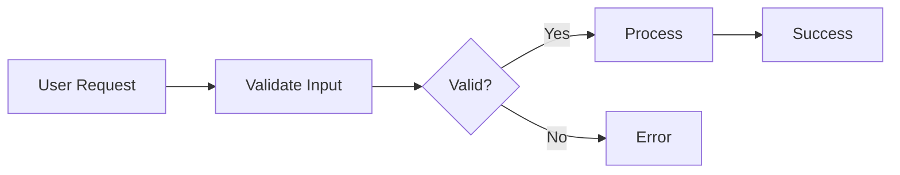
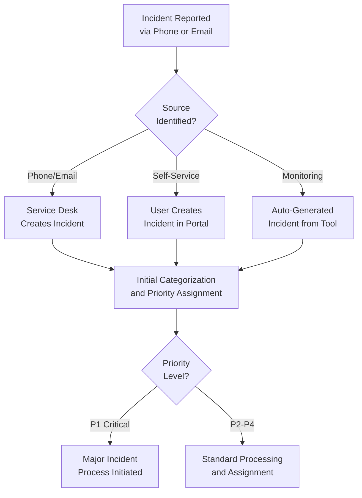
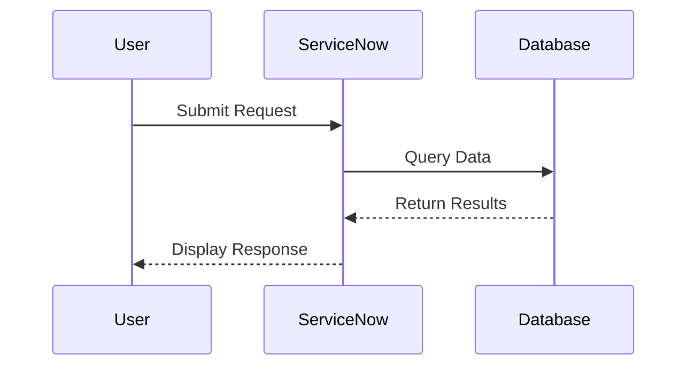
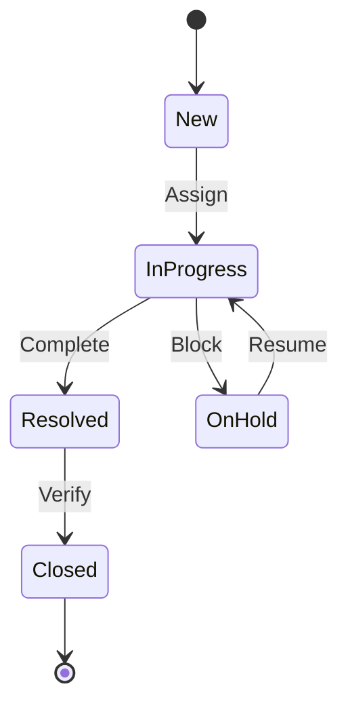
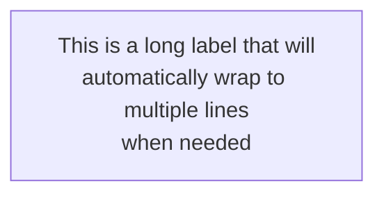
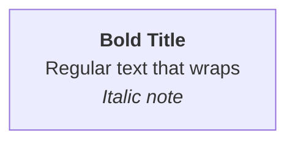

# Mermaid Diagram Support

## Overview

ServiceNow Helper includes comprehensive support for AI-generated Mermaid diagrams to enhance code documentation and solution explanations. Diagrams are automatically rendered in the UI, support streaming responses, and are included in both Markdown and PDF exports.

## Features

### **AI-Generated Diagrams**
- AI automatically generates Mermaid diagram code when requested
- Diagrams render automatically as interactive SVG visualizations
- Support for all Mermaid diagram types (flowcharts, sequence, class, state, ER, Gantt, pie, and more)
- Read-only display with optional source code viewing

### **Streaming Support**
- Diagrams wait for complete code before rendering during streaming
- Automatic rendering when closing ` ``` ` backticks are received
- Loading states show "Waiting for complete diagram code..." during streaming
- No parsing errors from incomplete Mermaid syntax

### **Theme Support**
- Diagrams automatically adapt to light/dark mode
- Theme changes update diagrams in real-time
- Consistent visual appearance across the application

### **Export Integration**
- **Markdown Export**: Preserves Mermaid code blocks as-is
- **PDF Export**: Renders diagrams as high-quality PNG images
- Automatic image scaling and positioning in PDFs
- Fallback to text if diagram rendering fails

## Supported Diagram Types

| Type | Description | Example Use Case |
|------|-------------|------------------|
| **Flowchart** | Process flows and decision trees | Business rule logic, approval workflows |
| **Sequence Diagram** | Interaction sequences | API call flows, user interactions |
| **Class Diagram** | Object-oriented structures | Data model relationships |
| **State Diagram** | State machines | Record lifecycle, status transitions |
| **ER Diagram** | Entity relationships | Database schema, table relationships |
| **Gantt Chart** | Project timelines | Implementation roadmaps |
| **Pie Chart** | Data visualizations | Usage statistics, distributions |
| **Git Graph** | Git workflows | Branching strategies |
| **Journey Map** | User journeys | User experience flows |
| **Mindmap** | Hierarchical concepts | Knowledge organization |
| **Timeline** | Event sequences | Historical progression |
| **C4 Diagrams** | Software architecture | System context, containers |

## How to Use

### **Requesting Diagrams from AI**

Simply ask the AI to include diagrams in your questions:

```
Examples:
- "Explain the ServiceNow incident management process with a flowchart"
- "Create a sequence diagram showing the approval workflow"
- "Draw an ER diagram for the CMDB tables"
- "Show me a state diagram for incident status transitions"
```

The AI will automatically generate Mermaid code that renders as an interactive diagram.

### **Viewing Diagrams**

1. **Rendered View** (Default)
   - Diagram displays as interactive SVG
   - Scales automatically to fit container
   - Supports zoom and pan in browser

2. **Source Code View**
   - Click "View Source" button to see Mermaid code
   - Copy button available for code reuse
   - Click "View Diagram" to return to rendered view

### **Exporting Diagrams**

#### **Markdown Export**
- Diagrams exported as ` ```mermaid` code blocks
- Perfect for documentation systems (GitHub, GitLab, Confluence)
- Version control friendly
- Can be edited and re-rendered

#### **PDF Export**
- Diagrams rendered as high-quality PNG images
- Embedded directly in PDF
- Maintains aspect ratio and sizing
- Professional appearance for presentations

## Technical Implementation

### **Components**

#### **MermaidDiagram Component**
- **Location**: `src/components/MermaidDiagram.tsx`
- **Purpose**: Renders Mermaid code to SVG
- **Features**:
  - Streaming-aware rendering
  - Theme integration
  - **Error suppression**: Never shows Mermaid error SVG bombs
  - **Pre-validation**: Syntax checked before rendering
  - Graceful error handling with user-friendly messages
  - Loading states

#### **CodeBlock Component**
- **Location**: `src/components/CodeBlock.tsx`
- **Purpose**: Detects Mermaid code blocks
- **Features**:
  - Lazy loading for performance
  - Source/diagram view toggle
  - Copy functionality
  - Streaming state propagation

#### **Export Utilities**
- **Location**: `src/lib/mermaid-export.ts`
- **Purpose**: SVG to PNG conversion for PDFs
- **Features**:
  - Base64 PNG generation
  - Image dimension calculation
  - Error handling

### **Error Handling**

The component implements **triple-layer error suppression** to ensure you NEVER see Mermaid's error SVG:

1. **Configuration Level**: `suppressErrorRendering: true` in Mermaid initialization
2. **Pre-validation**: Syntax checked with `mermaid.parse()` before rendering
3. **DOM Cleanup**: Removes any error SVGs that slip through

**Result**: Clean, user-friendly error messages instead of ugly error graphics.

### **How It Works**

1. **AI Generation**:
   ```markdown
   ```mermaid
   graph TD
       A[Start] --> B{Valid?}
       B -->|Yes| C[Process]
       B -->|No| D[Error]
   ```
   ```

2. **Detection**: CodeBlock component detects `language-mermaid` class

3. **Rendering**:
   - During streaming: Waits for complete code
   - When complete: Renders to SVG using Mermaid.js
   - Error handling: Shows error message with code

4. **Export**:
   - Markdown: Preserves original code
   - PDF: Converts SVG → Canvas → PNG → Embedded image

## Code Examples

### **Simple Flowchart**


### **Flowchart with Long Labels (Text Wrapping)**


**Note**: Use backtick-quoted strings (`` ` ``) for automatic text wrapping with long labels. This is supported in Mermaid v10.1.0+.

### **Sequence Diagram**


### **State Diagram**


## Performance Considerations

### **Lazy Loading**
- MermaidDiagram component loaded only when needed
- Reduces initial bundle size
- Faster page load times

### **Streaming Optimization**
- Code completion detection prevents premature rendering
- Reduces parsing errors
- Smooth user experience

### **Caching**
- Mermaid.js loaded once per session
- SVG cached in component
- Re-renders only on theme changes

## Troubleshooting

### **Diagram Not Rendering**

**Symptom**: Diagram shows loading spinner or error

**Solutions**:
1. Check Mermaid syntax is valid
2. Ensure streaming is complete (wait for closing ` ``` `)
3. View source to see actual Mermaid code
4. Check browser console for errors

### **Text Truncation or Overflow**

**Symptom**: Long labels are cut off or truncated

**Solutions**:
1. **Use backtick quotes for automatic wrapping**: Wrap labels in `` ` `` (backticks)
   ```mermaid
   flowchart TD
       A["`This is a very long label
       that will wrap automatically`"]
   ```
2. **Manual line breaks**: Insert newline characters within backtick-quoted strings
3. **Shorter labels**: Simplify text or use abbreviations
4. **Increase wrapping width**: This is automatically configured (200px default)

### **Export Issues**

**Symptom**: PDF export fails or shows text instead of diagram

**Solutions**:
1. Verify diagram renders in UI first
2. Check browser console for canvas errors
3. Try exporting as Markdown instead
4. Ensure browser supports Canvas API

### **Theme Issues**

**Symptom**: Diagram colors don't match theme

**Solutions**:
1. Toggle theme to refresh diagrams
2. Check Mermaid initialization in console
3. Clear browser cache and reload

## Best Practices

### **For AI Prompts**
1. Be specific about diagram type needed
2. Provide context for what to visualize
3. Request labels and descriptions
4. Ask for appropriate complexity level

### **For Diagrams**
1. Keep diagrams focused and simple
2. Use clear, descriptive labels
3. **Use backtick quotes for long labels**: Wrap long text in `` ` `` (backticks) for automatic text wrapping
   - Example: `A["`Long label text that will automatically wrap`"]`
4. Limit nodes/steps to maintain readability (aim for 10-15 nodes max)
5. Consider splitting complex flows into multiple diagrams
6. Use meaningful node IDs for better code organization

### **For Export**
1. Preview diagrams before exporting
2. Use Markdown for editable documentation
3. Use PDF for final presentations
4. Include descriptive text around diagrams

## Browser Support

| Browser | Rendering | Export | Notes |
|---------|-----------|--------|-------|
| Chrome 86+ | ✅ | ✅ | Full support |
| Edge 86+ | ✅ | ✅ | Full support |
| Firefox 78+ | ✅ | ✅ | Full support |
| Safari 14+ | ✅ | ✅ | Full support |
| Opera 72+ | ✅ | ✅ | Full support |

## Text Wrapping & Formatting

### **Automatic Text Wrapping (v10.1.0+)**

Mermaid supports automatic text wrapping using markdown strings (backtick quotes):



**Key Features:**
- **Automatic wrapping**: Text wraps at ~200 characters by default
- **Manual line breaks**: Use actual newlines within backtick quotes
- **Markdown formatting**: Supports **bold**, *italic* within labels
- **Better readability**: No need for `<br>` tags

**Syntax:**
- Old way: `A[This text needs<br/>manual breaks]`
- New way: `A["`This text wraps automatically`"]`

**Example with formatting:**


## Resources

### **Official Documentation**
- [Mermaid Official Docs](https://mermaid.js.org/)
- [Mermaid Live Editor](https://mermaid.live/) - Test diagrams
- [Mermaid Syntax Guide](https://mermaid.js.org/intro/)
- [Flowchart Text Wrapping](https://mermaid.js.org/syntax/flowchart.html#markdown-strings)

### **Diagram Type References**
- [Flowcharts](https://mermaid.js.org/syntax/flowchart.html)
- [Sequence Diagrams](https://mermaid.js.org/syntax/sequenceDiagram.html)
- [Class Diagrams](https://mermaid.js.org/syntax/classDiagram.html)
- [State Diagrams](https://mermaid.js.org/syntax/stateDiagram.html)
- [ER Diagrams](https://mermaid.js.org/syntax/entityRelationshipDiagram.html)
- [Gantt Charts](https://mermaid.js.org/syntax/gantt.html)

## Future Enhancements

Potential future improvements:
- Diagram editing capabilities
- Custom theme configuration
- Diagram templates library
- Interactive diagram annotations
- Diagram version history
- Collaborative diagram editing

## Support

For issues or questions about Mermaid diagram support:
1. Check this documentation first
2. Review Mermaid official documentation
3. Test in [Mermaid Live Editor](https://mermaid.live/)
4. Report bugs via GitHub issues
